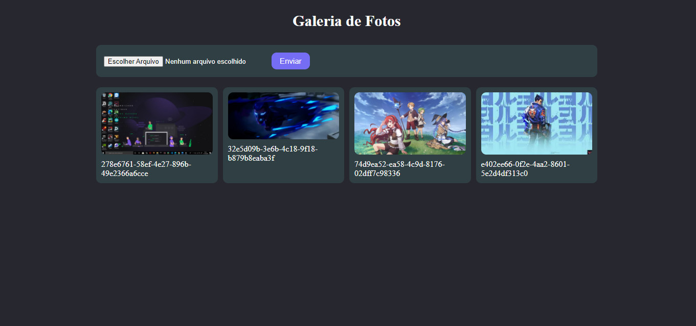

# Galeria :books: :

O terceiro projeto dessa maratona (5em5) de projetos é baseado em um sistema de galeria conectado ao Firebase para qualquer usuario. A imagem a baixo ilustra a arte do projeto:

A dinâmica seguiu os seguintes tópicos:

* Quando o sistema é ligado, ele primeiro vai para a pasta firebase procurando por todas as imagens.

* Após a verificação, ele exibe as imagens e se a pasta está vazia apresenta uma mensagem.

* Possui entrada para colocar as imagens que o usuário deseja salvar no Firebase.

## Extra:

O projeto foi desenvolvido em React Js, dessa forma toda sua estrutura é baseada no conceito de componentização e divisão dos serviços. Outro ponto importante é a utilização de hooks personalizados, onde crio o meu proprio expesifico para o projeto.

=> Para ver o funcionamento é necessario fazer um clone desse projeto.